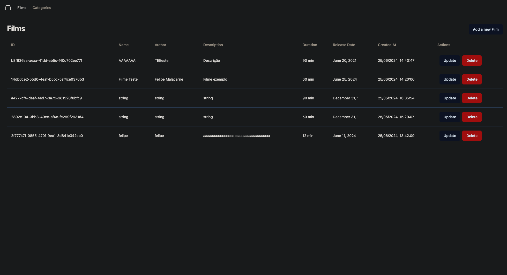
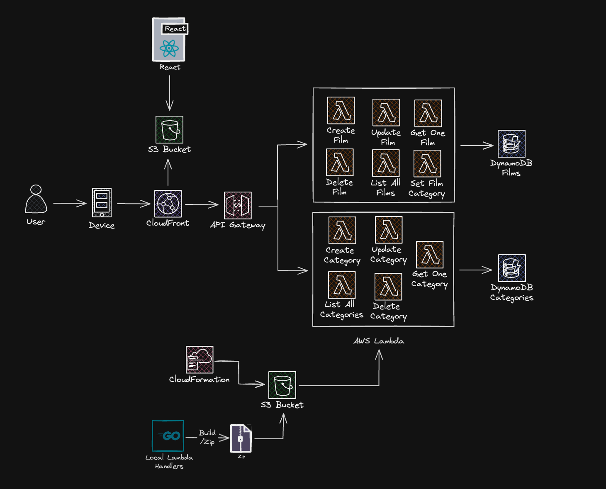

# Film Categories 

Aplicação Web para a atividade final da disciplina de programação Web. CRUD de Filmes e Categorias, Backend em Go, FrontEnd em react, banco de dados DynamoDB 

## Arquitetura

Deploy da nossa aplicação foi feito inteiramente serverless utilizando os serviços da aws. O Backend é compilado e comprimido e enviado para um AWS S3 Bucket,
juntamente com as configurações do AWS CloudFormation, que por sua vez Criam e Atualizam as AWS Lambdas que executam os binários de Go compilados. 
Essas lambdas são expostas pelo AWS API Gateway

Os arquivos estáticos da aplicação React estão servidos por um AWS S3 Bucket e distribuidos pelo AWS CloudFront

https://app.swaggerhub.com/apis-docs/FELIPEMALACARNE012/FilmsCategory/1.0.0#/Categories/post_category

## API - Swagger

A API está documentada no swagger:

- https://app.swaggerhub.com/apis-docs/FELIPEMALACARNE012/FilmsCategory/1.0.0#/Categories/post_category
